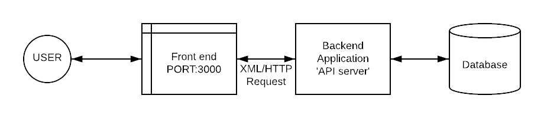

# Hands Up
##### Progress: 30 %

    HandsUp is a website based platform where students can approach and interact with the students regarding their doubt and issues facing during the distance learning program initiated by the schools and colleges. 

  - Nowadays, checking on the bulletin and recent affairs of the educational institutes could be a fuss, recent updates and bulletin could easily be accessed using HandsUp portal. 

  - Another amazing feature of our website is reinforced learning, there are questions that require HOTs and critical thinking those cannot just be use and throw, using HandsUp, the question can be revisited or reinforced.The solved question is sent back to the user to confirm the clarity of the student, until they are assured about their understanding. 

#### Why: 
> We feel that since the lockdown, the interaction between teachers and students has greatly reduced due to inefficiency of online classes.HandsUp will provide a platform for students to learn together, where student themselves will ask and answer academic questions along with sharing useful academic resources.

> The web app does not require technical power, so it can be run on any device.Since Hands Up is a self driven community of students, it is easily scalable.

> The platform promotes student to help each other, which helps in connecting the students.We believe that practicing is the best way to learn, so when students solve and answer questions they all practice and learn together.

> Reinforcement learning also helps to strengthen concepts and sharing resources with each other helps to develop sharing skills in young learners.Through the app, the core value of helping peers that will be beneficial to the students.


### Tech Stack

uses a number of open source projects to work properly:

* [Mongo DB] - Data Persistance!
    * [FB's React] - Frontend Virtual DOM.
        * [node.js] - evented I / O for the backend
            * [Express] - fast node.js network app framework 

### Installation

requires[Node.js](https://nodejs.org/) v4+ to run.

    Install the dependencies and devDependencies and start the server.

```sh
$ git clone https://github.com/Nish7/HandsUp.git
$ cd HandsUp
$ npm i
$ npm run dev 
```

For production environments...

```sh
$ npm start
```


Server Running on http:localhost:5000/
Client Running on http:localhost:3000/

### Server



### User flow   


### Backend Development

#### Routes

#####[ ] User

- [ ] GET -> api / v1 / users / -> Get all users -> PRIVATE / ADMIN
- [ ] GET -> api / v1 / users /: id -> Get all users -> PRIVATE / TEACHER / CLASSMATES
- [ ] PUT -> api / v1 / users /: userid -> update a user -> PRIVATE / USER
- [ ] DELETE -> api / v1 / users /: userid -> delete all users -> PRIVATE / USER

#####[] Auth

- [ ] POST -> api / v1 / auth / register -> Register User -> PUBLIC
- [ ] POST -> api / v1 / auth / callback -> Oauth / Passport Callback -> PUBLIC
- [ ] POST -> api / v1 / auth / login -> Login User -> PUBLIC
- [ ] GET -> api / v1 / auth / profile -> Get logged in user info -> PRIVATE

#####[] Classroom

- [ ] GET -> api / v1 / classroom / -> Get all classroom -> PRIVATE / ADMIN
- [ ] GET -> api / v1 / classroom /: id -> Get a single classroom -> PRIVATE / CLASSSTUDENTS / TEACHER
- [ ] POST -> api / v1 / classroom / -> create a classroom -> PRIVATE / TEACHER
- [ ] PUT -> api / v1 / classroom /: classId -> update a classroom -> PRIVATE / TEACHER
- [ ] DELETE -> api / v1 / classroom /: classId -> delete a classroom -> PRIVATE / TEACHER

#####[] Questions

- [ ] GET -> api / v1 / questions / -> Get all questions -> PRIVATE / ADMIN
- [ ] GET -> api / v1 / classroom /: classid / questions / -> Get all questions in a classroom -> PRIVATE / ADMIN
- [ ] GET -> api / v1 / classroom /: classid / questions /: questionId -> Get a single question in classroom -> PRIVATE / USER
- [ ] POST -> api / v1 / classroom /: classid / questions / -> post a question in a classroom -> PRIVATE / USER
- [ ] PUT -> api / v1 / classroom /: classid / questions /: questionid -> update a question in a classroom -> PRIVATE / USER
- [ ] DELETE -> api / v1 / classroom /: classid / questions /: questionId -> delete a question in a classroom -> PRIVATE / USER

##### Comment

- [ ] GET -> api / v1 / questions /: questionId / comments / -> Get all comments in a question -> PRIVATE / USER
- [ ] GET -> api / v1 / questions /: questionId / comments / -> post comment in a question -> PRIVATE / USER
- [ ] GET -> api / v1 / questions /: questionId / comments /: commentid -> Get a single question in classroom -> PRIVATE / USER
- [ ] PUT -> api / v1 / questions /: questionId / comments /: commentid -> update a single question in classroom -> PRIVATE / USER
- [ ] DELETE -> api / v1 / questions /: questionId / comments /: commentid -> delete a single question in classroom -> PRIVATE / USER

#### Models

##### User

- [ ] Google Id
- [ ] Name
- [ ] Role
- [ ] Google Token
- [ ] Email
- [ ] ClassroomId - array
- [ ] ProfilePic
- [ ] Questions - array

##### Classroom

- [ ] classId
- [ ] className
- [ ] teacherID
- [ ] students - array

##### Question

- [ ] questionId
- [ ] topic 
- [ ] votes
- [ ] subject
- [ ] classId
- [ ] text
- [ ] answers - array
- [ ] correctAnswer
- [ ] askedBy - userid

##### Comment

- [ ] questionId
- [ ] votes
- [ ] text
- [ ] userId


